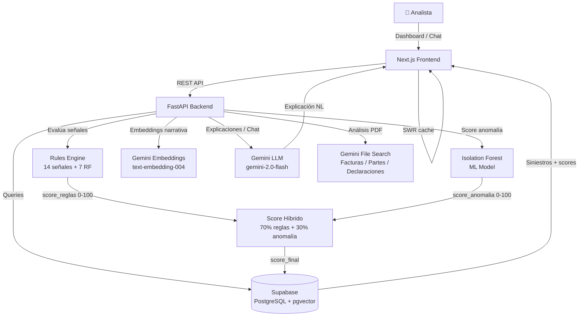

# 🔍 FraudIA — Detector de Posibles Fraudes en Siniestros

## 🌟 Introducción

Bienvenidos a **FraudIA**, nuestro proyecto para el **hackIAthon** (organizado por **Viamatica** e **IT ahora**). Abordamos el **Reto Aseguradora del Sur**: *Detector de Posibles Fraudes en Siniestros usando Inteligencia Artificial*.

FraudIA es un prototipo funcional que analiza siniestros de seguros y genera un **score de riesgo explicable**, combinando reglas de negocio, detección de anomalías con Machine Learning, análisis semántico de narrativas y un agente conversacional con IA generativa. La solución genera **alertas de revisión**, no acusaciones automáticas de fraude.

---

## 📑 Tabla de Contenidos

1. [Acerca del Proyecto](#-acerca-del-proyecto)
2. [Características Principales](#-características-principales)
3. [Stack Tecnológico](#-stack-tecnológico)
4. [Arquitectura del Sistema](#-arquitectura-del-sistema)
5. [Modelo de IA y Scoring](#-modelo-de-ia-y-scoring)
6. [Señales de Fraude y Reglas de Negocio](#-señales-de-fraude-y-reglas-de-negocio)
7. [Dataset](#-dataset)
8. [Estructura del Proyecto](#-estructura-del-proyecto)
9. [Empezando](#-empezando)
10. [Configuración](#-configuración)
11. [Seguridad y Ética](#-seguridad-y-ética)
12. [Autores](#-autores)

---

## 💡 Acerca del Proyecto

Los analistas de siniestros de Aseguradora del Sur procesan cientos de reclamos bajo presión de tiempo. La detección de fraude depende hoy de la experiencia individual del analista, reglas dispersas y revisiones documentales lentas.

**FraudIA** actúa como el primer nivel de triage: cada siniestro recibe un score de riesgo (0–100), una clasificación semáforo (🟢 Verde / 🟡 Amarillo / 🔴 Rojo), y una explicación en lenguaje natural de qué señales lo activaron. El analista decide; la IA prioriza y fundamenta.

---

## ✨ Características Principales

- 🚨 **Score Híbrido de Riesgo**: Combina 14 señales de reglas de negocio + Isolation Forest (ML) para calcular un puntaje 0–100 por siniestro.
- 🧠 **Agente Explicativo con IA**: Gemini con function-calling responde preguntas en lenguaje natural: *"¿Por qué este siniestro es rojo?"*, *"¿Qué proveedores concentran más alertas?"*.
- 📄 **Análisis de Documentos PDF**: Extrae y analiza facturas, partes policiales y declaraciones de accidente directamente desde archivos adjuntos.
- 🔗 **Red de Relaciones**: Visualización de conexiones entre asegurados, proveedores y siniestros observados para detectar patrones de red.
- 🗣️ **Similitud de Narrativas**: Embeddings de Gemini + pgvector detectan descripciones clonadas o muy similares entre reclamos.
- 📊 **Dashboard de Analista**: Bandeja priorizada por riesgo, filtros, semáforo visual, y vista detallada por siniestro con desglose de alertas.
- 📤 **Carga de Datasets**: Ingesta de archivos XLSX con siniestros, scoring en batch con backfill automático.
- 🔴 **Reglas Críticas (RF)**: 7 reglas que garantizan clasificación Rojo inmediata ante señales graves (pérdida total por robo, falsificación documental, lista restrictiva).

---

## 🛠️ Stack Tecnológico

**Frontend:**
- Next.js 16 (App Router)
- React 18
- Tailwind CSS + Shadcn UI
- Recharts (visualizaciones)
- SWR (caching de datos)

**Backend:**
- Python 3.11+
- FastAPI + Uvicorn
- Supabase Python SDK

**Base de Datos:**
- Supabase (PostgreSQL)
- pgvector (búsqueda semántica de narrativas)

**IA y Modelos:**
- **LLM**: Google Gemini (`gemini-2.0-flash`) con function-calling
- **Embeddings**: `models/text-embedding-004` (Gemini)
- **Anomaly Detection**: Isolation Forest (scikit-learn) + StandardScaler
- **PDF Analysis**: Gemini File Search API

**Infraestructura:**
- Docker + docker-compose
- Vercel (frontend)

---

## 🏗️ Arquitectura del Sistema



**Flujo de scoring de un siniestro:**
1. Carga del siniestro (XLSX o API)
2. Rules Engine evalúa 14 señales → `score_reglas`
3. Isolation Forest evalúa 6 features numéricas → `score_anomalia`
4. Blend: `score_final = 0.7 × score_reglas + 0.3 × score_anomalia`
5. Clasificación: Verde (0–40) / Amarillo (41–75) / Rojo (76–100)
6. Gemini genera explicación en lenguaje natural
7. Vectorización de narrativa → almacenada en pgvector para detección de similitud

---

## 🤖 Modelo de IA y Scoring

### Isolation Forest
- **Features**: `monto_reclamado`, `dias_entre_ocurrencia_reporte`, `dias_desde_inicio_poliza`, `reclamos_previos_asegurado`, `ratio_monto_suma`, `similitud_narrativa_max`
- **Contaminación estimada**: 8% (casos anómalos esperados)
- **Estimadores**: 200 árboles, `random_state=42`
- El modelo detecta casos fuera del comportamiento esperado sin necesitar etiquetas de fraude.

### Blend Final
```
score_final = 0.7 × score_reglas + 0.3 × score_anomalia
```
Las reglas aportan trazabilidad y explicabilidad. El ML captura anomalías numéricas no cubiertas por reglas.

### Clasificación Semáforo

| Rango | Nivel | Acción sugerida |
|-------|-------|----------------|
| 0 – 40 | 🟢 Verde — Bajo | Continuar flujo normal |
| 41 – 75 | 🟡 Amarillo — Medio | Escalar a Unidad Antifraude para revisión documental |
| 76 – 100 | 🔴 Rojo — Alto | Escalar a Unidad Antifraude para revisión especializada de campo |

### Agente de IA (Gemini Function Calling)
El agente puede responder en lenguaje natural:
- ¿Cuáles son los 10 siniestros con mayor riesgo?
- ¿Por qué este siniestro fue marcado como rojo?
- ¿Qué proveedores concentran más alertas?
- ¿Qué ramos tienen mayor porcentaje de casos sospechosos?
- Generar resumen ejecutivo de casos críticos.

---

## 🚨 Señales de Fraude y Reglas de Negocio

### 14 Señales de Riesgo (Scoring)

| Señal | Puntos máx. |
|-------|------------|
| Reclamo cercano al borde de vigencia (≤ 30 días) | 8 pts |
| Demora denuncia por robo (> 48 hrs) | 8 pts |
| Alta frecuencia de reclamos — asegurado (≥ 3 en 18 meses) | 8 pts |
| Alta frecuencia de reclamos — vehículo | 6 pts |
| Alta frecuencia — conductor en múltiples siniestros | 8 pts |
| Alta frecuencia reclamos solo RC | 6 pts |
| Beneficiario / proveedor recurrente observado | 10 pts |
| Documentos incompletos | 4 pts |
| Dinámica sospechosa (relato ilógico vs. tipo de impacto) | 6 pts |
| Evento sin tercero identificado | 6 pts |
| Documentos inconsistentes / adulterados | 10 pts |
| Reporte tardío (> 7 días) | 5 pts |
| Narrativas similares (> 85% similitud textual) | 8 pts |
| Monto cercano o superior a suma asegurada | 5 pts |

### 7 Reglas Críticas (Garantizan Rojo inmediato)

| Código | Regla | Clasificación |
|--------|-------|--------------|
| RF01 | Cobertura Pérdida Total por Robo (PTxRB) | 🔴 Rojo |
| RF02 | Evidencia de Falsificación o Adulteración Documental | 🔴 Rojo |
| RF03 | Asegurado / Beneficiario / APS en Lista Restrictiva | 🔴 Rojo |
| RF04 | Dinámica del Accidente Físicamente Imposible | 🔴 Rojo |
| RF05 | Siniestro Extremo al Borde de Vigencia (< 48 hrs) | 🟡 Amarillo |
| RF06 | Demora Atípica en Denuncia de Robo (> 4 días) | 🟡 Amarillo |
| RF07 | Narrativa Idéntica (Clonada) | 🟡 Amarillo |

---

## 📊 Dataset

El proyecto utiliza datos **sintéticos** que simulan la estructura real de siniestros de Aseguradora del Sur. No contienen información personal identificable.

```
data/
├── raw/
│   ├── evento/
│   │   ├── Evento_Datasets_Sinteticos_Fraude_500_v2.xlsx   ← Dataset principal (500 casos)
│   │   ├── declaracion_accidente/    ← PDFs de declaraciones sintéticas
│   │   ├── facturas/                 ← PDFs de facturas sintéticas
│   │   └── parte_policial/           ← PDFs de partes policiales sintéticos
└── synthetic/
    ├── siniestros_seed.csv           ← Datos semilla para Supabase
    └── asegurados_seed.csv
```

**Dataset principal** (`Evento_Datasets_Sinteticos_Fraude_500_v2.xlsx`):
- 500 siniestros sintéticos con distribución realista de tipos de fraude
- Campos: id_siniestro, id_poliza, id_asegurado, ramo, cobertura, fechas, montos, estado, documentos, narrativa, etiqueta_fraude_simulada

---

## 📂 Estructura del Proyecto

```text
fraudia-claims/
├── README.md
├── requirements.txt
├── .env.example
├── Dockerfile
├── docker-compose.yml
│
├── data/
│   ├── raw/evento/                   # Dataset Aseguradora del Sur
│   └── synthetic/                    # CSVs semilla
│
├── src/
│   ├── app/main.py                   # FastAPI — endpoints de scoring, upload, chat
│   ├── rules/fraud_rules.py          # 14 señales + 7 reglas RF
│   ├── models/fraud_model.py         # Isolation Forest + blend
│   ├── ai_agent/
│   │   ├── claims_agent.py           # Agente conversacional Gemini
│   │   ├── function_agent.py         # Function-calling tools
│   │   ├── pdf_analyzer.py           # Análisis de PDFs con Gemini
│   │   └── llm_provider.py           # Abstracción LLM (Gemini / OpenAI fallback)
│   └── ingestion/
│       ├── load_data.py              # Carga y seed de Supabase
│       └── backfill_scoring.py       # Re-scoring en batch
│
├── app/                              # Next.js App Router
│   ├── page.tsx                      # Dashboard principal
│   ├── siniestros/                   # Lista y detalle de siniestros
│   ├── chat/                         # Chat con el agente de IA
│   ├── red/                          # Red de relaciones
│   ├── nuevo/                        # Carga de nuevo siniestro
│   └── api/                          # Route handlers (Next.js)
│
├── components/                       # Componentes React (Shadcn UI)
├── tests/                            # Tests de reglas y casos críticos
└── models/                           # Modelos .pkl (Isolation Forest)
```

---

## 🚀 Empezando

### Prerrequisitos
- Node.js v18+
- Python 3.11+
- Cuenta Supabase (con extensión `pgvector` habilitada)
- API Key de Google Gemini

### 1. Clonar e Instalar Dependencias

```bash
git clone https://github.com/drahcirok/fraudia-claims.git
cd fraudia-claims

# Frontend
npm install

# Backend
python -m venv venv
source venv/bin/activate   # Windows: venv\Scripts\activate
pip install -r requirements.txt
```

### 2. Configurar Variables de Entorno

```bash
cp .env.example .env
# Editar .env con tus credenciales (ver sección Configuración)
```

### 3. Inicializar Base de Datos

```bash
# Seed inicial de Supabase con datos sintéticos
python -m src.ingestion.load_data

# Entrenar modelo Isolation Forest y aplicar scores
python -m src.models.fraud_model

# Backfill de scores para todos los siniestros
python -m src.ingestion.backfill_scoring
```

### 4. Ejecutar

```bash
# Opción A — Desarrollo (frontend + backend separados)
npm run dev          # Frontend en http://localhost:3000
uvicorn src.app.main:app --reload --port 8000   # Backend en http://localhost:8000

# Opción B — Docker
docker-compose up --build
```

---

## ⚙️ Configuración

Crea `.env` basado en `.env.example`:

```env
# Supabase (obligatorio)
SUPABASE_URL=https://tu-proyecto.supabase.co
SUPABASE_ANON_KEY=tu_anon_key
SUPABASE_SERVICE_ROLE_KEY=tu_service_role_key

# Google Gemini (obligatorio)
GEMINI_API_KEY=tu_gemini_api_key

# OpenAI (opcional — fallback del agente)
OPENAI_API_KEY=tu_openai_api_key

# Next.js — exponer al frontend
NEXT_PUBLIC_SUPABASE_URL=https://tu-proyecto.supabase.co
NEXT_PUBLIC_SUPABASE_ANON_KEY=tu_anon_key
```

---

## 🛡️ Seguridad y Ética

**Privacidad de datos:**
- Solo se usan datos sintéticos. No se procesa información personal real.
- Ningún identificador en el dataset corresponde a personas reales.

**Ética en IA:**
- El sistema genera **alertas de revisión**, nunca acusaciones de fraude.
- Toda decisión final es tomada por un **analista humano**.
- El lenguaje siempre es *"posible indicador"* / *"requiere revisión"*.
- El sistema documenta sus limitaciones: falsos positivos son esperados e inherentes.

**Seguridad técnica:**
- Credenciales gestionadas vía `.env`; nunca en el repositorio.
- CORS configurado en FastAPI.
- Claves API nunca expuestas al frontend.

---

## 👥 Autores

Desarrollado para el **hackIAthon 2026 — Reto Aseguradora del Sur**:

- **Castro Adolfo**
- **Burgos Richard**

Organizado por: **Viamatica** · Co-organizador: **IT ahora**
